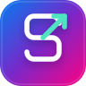

<!-- SpendsTracks - Personal Finance Tracker -->
<!-- Version: 1.1.1 -->
<!-- Build: Production Ready -->

<div align="center">

  

  <h1>SpendsTracks</h1>

  <p>A modern, professional personal finance tracker built with Next.js 14, React 18, and Tailwind CSS</p>

  <!-- Badges -->
  <p>
    
    
    
    
    
  </p>

  <!-- CTA Buttons -->
  <p>
    <a href="#quick-start">
      
    </a>
    <a href="#features">
      
    </a>
    <a href="#demo-credentials">
      
    </a>
  </p>

</div>

---

## 📋 Table of Contents

- [✨ Features](#features)
- [🛠️ Tech Stack](#tech-stack)
- [🚀 Quick Start](#quick-start)
- [📁 Project Structure](#project-structure)
- [🎨 Design System](#design-system)
- [🔐 Authentication](#authentication)
- [💾 Data Storage](#data-storage)
- [📱 Mobile Responsive](#mobile-responsive)
- [🏗️ Build & Deploy](#build--deploy)
- [🤝 Contributing](#contributing)
- [📄 License](#license)
- [👨‍💻 Developer](#developer)

---

## ✨ Features <a id="features"></a>

### Core Features

| Feature | Description |
|---------|-------------|
| **💰 Expense Tracking** | Add, edit, and categorize expenses with detailed notes |
| **💵 Income Management** | Track multiple income sources (salary, freelance, investments) |
| **📊 Analytics Dashboard** | Visual charts showing spending patterns and trends |
| **🎯 Financial Goals** | Set and track progress toward savings goals |
| **🔄 Recurring Transactions** | Manage subscription payments and recurring bills |
| **🏷️ Custom Categories** | Create personalized expense/income categories |
| **📈 Budget Planning** | Set monthly budgets with spending alerts |
| **🔍 Transaction History** | Search and filter through all transactions |

### User Experience

| Feature | Description |
|---------|-------------|
| **🌙 Dark/Light Mode** | System-aware theme toggle with smooth transitions |
| **🎬 Smooth Animations** | Fluid transitions powered by Framer Motion |
| **📱 Mobile-First Design** | Optimized for mobile devices with responsive layout |
| **⚡ Fast Performance** | Optimized build with Next.js App Router |
| **🔔 Toast Notifications** | Real-time feedback for all user actions |
| **✓ Form Validation** | Input validation with helpful error messages |
| **♿ Accessibility** | ARIA labels and keyboard navigation support |

### Security & Privacy

| Feature | Description |
|---------|-------------|
| **🔒 Local Storage** | Data stored locally - no server required |
| **👤 Guest Mode** | Try app without account creation |
| **📜 Terms & Privacy** | Mandatory agreement with scroll-to-read |
| **🛡️ Data Encryption** | Client-side data protection |

---

## 🛠️ Tech Stack <a id="tech-stack"></a>

### Framework & Libraries

```
┌─────────────────────────────────────────────────────────────┐
│                      CORE                                   │
├─────────────────────────────────────────────────────────────┤
│  Next.js 14        │ App Router, Server Components         │
│  React 18          │ Hooks, Context, Suspense              │
│  TypeScript 5.7     │ Type Safety, IntelliSense             │
└─────────────────────────────────────────────────────────────┘

┌─────────────────────────────────────────────────────────────┐
│                      STYLING                                │
├─────────────────────────────────────────────────────────────┤
│  Tailwind CSS 3.4  │ Utility-first CSS Framework           │
│  Framer Motion 11  │ Complex Animations                     │
│  Recharts 2        │ Data Visualization                     │
│  Lucide React      │ Icon System                            │
└─────────────────────────────────────────────────────────────┘

┌─────────────────────────────────────────────────────────────┐
│                      UI COMPONENTS                          │
├─────────────────────────────────────────────────────────────┤
│  Radix UI          │ Accessible Select, Switch, Dialog    │
│  CVA               │ Component Variants                    │
│  Tailwind Merge    │ Class Merging Utility                 │
└─────────────────────────────────────────────────────────────┘
```

### Development Tools

```
┌─────────────────────────────────────────────────────────────┐
│                      DEV TOOLS                              │
├─────────────────────────────────────────────────────────────┤
│  ESLint 8         │ Code Linting                           │
│  Prettier         │ Code Formatting                        │
│  PostCSS          │ CSS Processing                         │
│  Vercel           │ Deployment Platform (Recommended)      │
└─────────────────────────────────────────────────────────────┘
```

---

## 🚀 Quick Start <a id="quick-start"></a>

### Prerequisites

- **Node.js** >= 18.0.0
- **npm** or **yarn**

### Installation

```bash
# Clone the repository
git clone https://github.com/Prathamesh-Jadhav04/SpendsTracks.git

# Navigate to project directory
cd SpendsTracks

# Install dependencies
npm install

# Start development server
npm run dev
```

### Build for Production

```bash
# Create production build
npm run build

# Start production server
npm run start
```

### Development Tools

```bash
# Run linter
npm run lint
```

---

## 📁 Project Structure <a id="project-structure"></a>

```
SpendsTracks/
├── app/                          # Next.js App Router
│   ├── layout.tsx               # Root layout with providers
│   ├── page.tsx                 # Main page
│   └── not-found.tsx            # 404 page
├── components/
│   ├── spendstracks-app.tsx     # Main app component (ALL SCREENS)
│   ├── theme-provider.tsx       # Theme context provider
│   └── ui/                      # Shadcn UI components
│       ├── button.tsx
│       ├── card.tsx
│       ├── input.tsx
│       ├── select.tsx
│       ├── switch.tsx
│       └── ...
├── lib/
│   └── utils.ts                 # Utility functions (cn)
├── public/
│   └── spendstracks-logo.svg    # App logo
├── styles/
│   └── globals.css              # Global styles & CSS variables
├── tailwind.config.ts           # Tailwind configuration
├── next.config.mjs              # Next.js configuration
└── package.json                 # Dependencies & scripts
```

---

## 🎨 Design System <a id="design-system"></a>

### Color Palette

| Color | Light Mode | Dark Mode | Usage |
|-------|------------|-----------|-------|
| **Primary** | `#10b889` (Emerald) | `#10b889` | Main actions, highlights |
| **Secondary** | `#7766e8` (Purple) | `#7766e8` | Secondary actions |
| **Background** | `#f8fafc` | `#0a0a0a` | Page background |
| **Surface** | `#ffffff` | `#1a1a2e` | Cards, modals |
| **Text** | `#0f172a` | `#f8fafc` | Primary text |
| **Muted** | `#64748b` | `#94a3b8` | Secondary text |

### Typography

- **Headings**: System fonts (Inter-style)
- **Body**: System fonts with clear hierarchy
- **Numbers**: Tabular nums for financial data

### Animations

- Screen transitions: 250ms ease-out
- Micro-interactions: Spring animations
- Loading states: Smooth spinners

---

## 🔐 Authentication <a id="authentication"></a>

### Login Options

1. **Email + Password** - Full account creation
2. **Guest Mode** - Try without registration
3. **Admin Mode** - Access demo data

### Demo Credentials <a id="demo-credentials"></a>

| Type | Email | Password | Access |
|------|-------|----------|--------|
| **Admin** | `admin@spendstracks.com` | Any | Demo data |
| **User** | `user@example.com` | Any | Fresh account |
| **Guest** | Click "Continue as Guest" | None | Empty data |

---

## 💾 Data Storage <a id="data-storage"></a>

### LocalStorage Schema

```typescript
interface AppData {
  transactions: Transaction[];
  transactionHistory: Transaction[];
  goals: Goal[];
  recurring: Recurring[];
  customCategories: CustomCategory[];
  monthlyBudget: number;
  user: User | null;
}
```

### Data Persistence

- **Auto-save**: Changes persist immediately
- **Key**: `spendstracks_data`
- **Format**: JSON with localStorage

---

## 📱 Mobile Responsive <a id="mobile-responsive"></a>

### Responsive Breakpoints

```
Mobile:  320px - 480px (Primary target)
Tablet:  481px - 768px
Desktop: 769px+ (Max-width: 500px container)
```

### Mobile Features

- Touch-friendly tap targets (min 44px)
- Bottom navigation bar
- Swipe-friendly interactions
- Optimized for portrait mode

---

## 🏗️ Build & Deploy <a id="build--deploy"></a>

### Vercel (Recommended)

```bash
# Install Vercel CLI
npm i -g vercel

# Deploy
vercel
```

### Other Platforms

| Platform | Command | Notes |
|----------|---------|-------|
| **Vercel** | `vercel deploy` | Zero-config |
| **Netlify** | `netlify deploy` | Drag & drop build folder |
| **Railway** | `railway up` | Node.js template |
| **Render** | Push to Git | Web service |

### Environment Variables

```env
# Optional - for production analytics
NEXT_PUBLIC_ANALYTICS_ID=your_id
```

---

## 🤝 Contributing <a id="contributing"></a>

### Development Workflow

1. **Fork** the repository
2. **Clone** your fork
3. **Create** a feature branch (`git checkout -b feature/amazing`)
4. **Commit** your changes (`git commit -m 'Add amazing feature'`)
5. **Push** to branch (`git push origin feature/amazing`)
6. **Open** a Pull Request

### Code Style

- Follow existing patterns in codebase
- Use TypeScript for new components
- Run `npm run lint` before commit
- Test on mobile viewport

---

## 📄 License <a id="license"></a>

MIT License - See [LICENSE](LICENSE) file for details.

---

## 👨‍💻 Developer <a id="developer"></a>

### Connect

<p align="center">
  <a href="https://linkedin.com/in/prathamesh-jadhav04" target="_blank">
    
  </a>
  <a href="https://github.com/Prathamesh-Jadhav04" target="_blank">
    
  </a>
  <a href="mailto:prathamesh.jadhav.office@gmail.com">
    
  </a>
</p>

### Build Info

```
Version:      1.1.1
Build Date:   May 2026
Framework:    Next.js 14.2.35
React:        18.3.1
Status:       Production Ready ✅
```

---

<p align="center">

  
  

</p>

<div align="center">

<sub>Built with 💚 by <a href="https://github.com/Prathamesh-Jadhav04">Prathamesh Jadhav</a></sub>

</div>