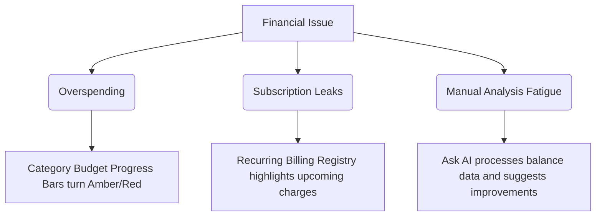

# 📊 SpendsTracks — Smart Expense & Budget Tracker

<div align="center">

[](https://nextjs.org/)
[](https://react.dev/)
[](https://www.typescriptlang.org/)
[](https://tailwindcss.com/)
[](https://supabase.com/)
[](LICENSE)

**An ultra-premium, mobile-first personal finance tracking application engineered with a stark developer aesthetic, interactive analytics, savings goals tracking, subscription management, and an on-demand AI financial advisor.**

[Explore App](#) • [Features](#3-core-features--deep-dive) • [Setup & Activation](#6-activation--setup-guide) • [Database Schema](#7-supabase-database-schema-setup) • [Deployment](#8-vercel-deployment-manual)

</div>

---

## Table of Contents

1. [Overview & Executive Summary](#1-overview--executive-summary)
2. [Product Architecture & Codebase Map](#2-product-architecture--codebase-map)
3. [Core Features & Deep Dive](#3-core-features--deep-dive)
4. [The Philosophy: Why SpendsTracks?](#4-the-philosophy-why-spendstracks)
5. [Problem Solver: How the App Works](#5-problem-solver-how-the-app-works)
6. [Activation & Setup Guide](#6-activation--setup-guide)
7. [Supabase Database Schema Setup](#7-supabase-database-schema-setup)
8. [Vercel Deployment Manual](#8-vercel-deployment-manual)
9. [OpenCode AI Grounding Architecture](#9-opencode-ai-grounding-architecture)
10. [UI/UX Design Tokens & Aesthetics Reference](#10-uiux-design-tokens--aesthetics-reference)
11. [Component API Documentation](#11-component-api-documentation)
12. [Custom Hooks & Business Logic Blueprint](#12-custom-hooks--business-logic-blueprint)
13. [E2E Testing & Playwright Specifications](#13-e2e-testing--playwright-specifications)
14. [Troubleshooting & Local Debugging Guide](#14-troubleshooting--local-debugging-guide)
15. [Frequently Asked Questions (FAQ)](#15-frequently-asked-questions-faq)
16. [Developer Onboarding Checklist](#16-developer-onboarding-checklist)
17. [Comprehensive TypeScript Type Reference](#17-comprehensive-typescript-type-reference)
18. [Screen Navigation Architecture Map](#18-screen-navigation-architecture-map)
19. [Roadmap & Future Extensions](#19-roadmap--future-extensions)
20. [Contributing Guidelines](#20-contributing-guidelines)
21. [License](#21-license)

---

## 1. Overview & Executive Summary

**SpendsTracks** is a next-generation personal finance tracker designed for developers, creators, and modern professionals. The project abandons boring, complicated grids and invasive bank account connections in favor of a fast, manual double-entry ledger styled with a high-end, Vercel-inspired dark-and-white theme.

By combining manual ledger controls, sub-category threshold budgeting, savings targets milestones, subscription cycles tracking, and a serverless AI grounding advisor, SpendsTracks shifts the paradigm from passive data aggregation to active financial planning. It features full dual offline/online state storage: running seamlessly via LocalStorage in guest mode, or syncing to cloud tables with Supabase JWT authentication.

### Technology Stack Specifications
The codebase is structured under strict type-safe modular conditions:

*   **Next.js (App Router, Version 14.2.35):** Powering route structures, layout assemblies, and dynamic API compilation.
*   **React (Version 18.3.1):** Managing interactive view state hooks, component trees, and layout updates.
*   **TypeScript (Version 5.7.2):** Strict type mapping for ledger entities, transactions, configurations, and API schemas.
*   **Tailwind CSS (Version 3.4.16):** Utility configurations styled with custom variables for visual consistency.
*   **Framer Motion (Version 11.15.0):** Spring physics page transitions, active sliders, and modal card openings.
*   **Recharts (Version 2.13.3):** Visual layouts representing category shares (Pie chart) and monthly budget curves (Bar chart).
*   **Supabase Database Integration (`@supabase/supabase-js ^2.108.1` & `@supabase/ssr ^0.12.0`):** Secure user verification, database sync, and real-time backend updates.

---

## 2. Product Architecture & Codebase Map

The project directory is structured as a clean, standardized Next.js App Router codebase:

```text
SpendsTracks/
├── app/                         # App Router Root
│   ├── api/                     # Backend API routes
│   │   └── chat/                # OpenCode AI Advisor route handler
│   │       └── route.ts         # Serverless completions controller
│   ├── layout.tsx               # Main HTML entry and font configuration
│   ├── page.tsx                 # Root landing wrapper
│   └── not-found.tsx            # Clean 404 handler
├── components/                  # Application Modules
│   ├── auth/                    # Verification Screens
│   │   ├── index.ts             # Auth exports
│   │   ├── login-screen.tsx     # Login controller
│   │   ├── signup-screen.tsx    # Sign up controller
│   │   └── reset-password-screen.tsx # Password recovery controller
│   ├── constants/               # Configs & Seed Data
│   │   └── index.ts             # Category maps and seed transactions
│   ├── hooks/                   # Business Logic custom hooks
│   │   ├── index.ts             # Exports mapping
│   │   ├── use-app-data.ts      # Ledger storage & CRUD controller
│   │   ├── use-auth.ts          # Auth state manager
│   │   ├── use-currency.ts      # Formatting numbers
│   │   ├── use-language.ts      # Language selection manager
│   │   ├── use-navigation.ts    # Screen router hook
│   │   └── use-toast.ts         # Notification system
│   ├── screens/                 # Component Screens
│   │   ├── add-transaction-screen.tsx # Add Expense/Income form
│   │   ├── analytics-screen.tsx # Statistics page (Recharts)
│   │   ├── ask-ai-screen.tsx    # AI chat interface
│   │   ├── categories-screen.tsx # Custom category budgets panel
│   │   ├── dashboard-screen.tsx # Balance details and feed
│   │   ├── goals-screen.tsx     # Savings targets tracker
│   │   ├── profile-screen.tsx   # Language, budget configuration
│   │   ├── recurring-screen.tsx # Subscription billing ledger
│   │   ├── reports-screen.tsx   # Time-range statements screen
│   │   ├── splash-screen.tsx    # Initial boot loader
│   │   ├── transaction-detail-screen.tsx # Edit / Delete details overlay
│   │   └── transactions-screen.tsx # Search, filter, and audit feed
│   ├── shared/                  # Common UI blocks
│   │   ├── bottom-nav.tsx       # Bottom bar / Sidebar component
│   │   ├── modal.tsx            # Backdrop modal overlay
│   │   ├── phone-frame.tsx      # Sandbox viewport wrapper
│   │   └── transaction-row.tsx  # Dynamic list item row
│   ├── spendstracks-app.tsx     # Unified layout and routing router orchestrator
│   ├── theme-provider.tsx       # Light/Dark context wrapper
│   ├── types/                   # TypeScript Type Interfaces
│   │   └── index.ts             # Global models (Transaction, Goal, Recurring)
│   └── ui/                      # Base primitives (custom input, dialog)
├── lib/                         # Configuration and utilities
│   ├── supabase.ts              # Supabase Client Client configuration
│   └── utils.ts                 # Formatting helper library
├── public/                      # Static assets
├── styles/                      # Tailwind styles
│   └── globals.css              # Custom font and HSL variables
├── tailwind.config.ts           # Typography and style extensions
├── tsconfig.json                # Strict TypeScript configuration
└── package.json                 # Dependency version specs
```

### Module Descriptions & Architectural Responsibilities

#### 1. Core State Orchestrator (`components/spendstracks-app.tsx`)
This is the heart of the front-end application. It wraps the workspace inside the interactive simulated `PhoneFrame`, reads the system configuration, boots the `useAuth` state machine, and dynamically mounts screens based on the current navigation context. It also integrates screen transitions with smooth spring animations.

#### 2. Screen Modules (`components/screens/`)
*   **`dashboard-screen.tsx`:** Aggregates and displays the current financial state. Renders statistics cards, total net worth, and the quick ledger preview.
*   **`transactions-screen.tsx`:** Provides an interactive feed of all transactions with real-time text filters, currency conversions, and edit dialogs.
*   **`analytics-screen.tsx`:** Integrates Recharts to display category breakdowns and monthly income versus expenses.
*   **`categories-screen.tsx`:** Manages category creation, custom color selection, and budget limits.
*   **`goals-screen.tsx`:** Tracks progress toward target savings goals.
*   **`recurring-screen.tsx`:** Manages repeating subscription billing events.
*   **`reports-screen.tsx`:** Generates summary statements of income and expenses over custom date ranges.
*   **`ask-ai-screen.tsx`:** Contains the chatbot interface for the AI Financial Advisor.
*   **`profile-screen.tsx`:** Configures user preferences, currency symbols, and account details.

#### 3. Custom Hooks (`components/hooks/`)
*   **`use-app-data.ts`:** Manages CRUD operations and state synchronization between LocalStorage and Supabase.
*   **`use-auth.ts`:** Handles user registration, login, session states, and guest authentication.
*   **`use-currency.ts`:** Formats values based on the selected currency and locale.
*   **`use-language.ts`:** Translates static labels and interface elements.

---

## 3. Core Features & Deep Dive

### 📱 Unified Fintech Dashboard
The main hub of SpendsTracks. It aggregates financial data into an easily digestible summary layout.
*   **Balance Dashboard:** Displays your Total Balance, Monthly Income, and Monthly Expenses. The values are automatically calculated from all logged transactions.
*   **Stat Cards:** Highlights current progress with color-coded tags.
*   **Recent Transactions:** Displays the last few transactions with custom category icons, tags, notes, and values.

```typescript
// Transaction Type Model Reference
export interface Transaction {
  id: string;
  title: string;
  detail: string;
  amount: number;
  tone: string; // matches category values
  icon: string; // Emoji or Lucide label
  date?: string;
  type: "expense" | "income";
  category: string;
}
```

### 💸 Double-Entry Transaction Tracker
Adding items is simple, quick, and verified.
*   **Validation:** Amount inputs check for values greater than zero.
*   **Categorization:** Allows selecting a specific category using an accessible custom Radix UI dropdown trigger.
*   **Backdated Entries:** Allows backdating entries to update previous balances.
*   **Notes:** Text fields let you write specific descriptions, which are stored as transaction details.

### 🔍 Interactive Transaction History
The history log provides full audit control:
*   **Text Filter:** Instantly filters rows as you type.
*   **Casing Insensitive:** Searches notes, descriptions, and category titles.
*   **Edit & Delete:** Tap any row to view complete details, delete the item, or modify its values.

### 📊 Time-Range Insights & Analytics
Analyzes spending trends using interactive charts:
*   **Pie Chart Breakdown:** Recharts display of expense percentages per category (e.g. food, shopping).
*   **Trend Bars:** Compares monthly income vs expenses.
*   **Time frames:** View data for the Week, Month, Quarter, Year, or All Time.

### 🎯 Savings Goals Lifecycle
Users can track their savings targets directly:
*   **Progress Indicators:** Shows savings percentages against target amounts.
*   **Goal Funding:** Click "Add Funds" to allocate money from your balance to a goal.
*   **Goal Removal:** Easily delete completed or legacy goals.

### 🔁 Subscription Billing Registry
Never forget a recurring fee:
*   **Subscription Details:** Enter Title, Amount, Frequency (Daily, Weekly, Monthly), and Category.
*   **Billing Reminders:** Displays next billing dates based on frequency intervals.

### 🏷️ Custom Categories & Budgets
Tailor the app to your spending habits:
*   **Custom Labels:** Create custom categories with custom icons and colors.
*   **Monthly Thresholds:** Set category budget limits (e.g., limit Food spending to ₹10,000). Visual progress bars turn red when you approach or breach your limit.

### 🤖 Ask AI Financial Advisor
An on-demand financial assistant:
*   **Real-time Grounding:** The chat request automatically sends your current financial context (balances, transaction history, categories, goals, subscriptions).
*   **Concise Advice:** Renders markdown tips to help you reduce expenses and reach your savings goals.
*   **Hinglish Support:** Responds in Hinglish or English based on the language you use.

### ⚙️ Profile Configurations & Data Export
Configure your settings:
*   **Budget Presets:** Modify your baseline monthly budget.
*   **Preferences:** Set your preferred currency symbol (e.g., ₹, $, €) and UI language.
*   **Data Portability:** Click "Export" on the Analytics page to download your entire transaction list as a clean CSV file (`spendstracks-export.csv`).

---

## 4. The Philosophy: Why SpendsTracks?

Many personal finance applications struggle with three major issues: **excessive complexity**, **loss of privacy**, and **spreadsheet fatigue**.

1.  **Complexity Overload:** Automatic syncing often fails due to banking MFA policies, leading to incorrect transaction labels and messy grids that create financial anxiety.
2.  **Privacy Concerns:** Uploading financial statements to third-party databases exposes users to data mining and hacks.
3.  **Spreadsheet Fatigue:** Custom sheets offer privacy but are difficult to update and read on mobile viewports.

**SpendsTracks** solves these issues by providing a **fast, manual entry fintech ledger** designed with a premium, Vercel-inspired UI. It focuses on manual tracking to keep users engaged with their spending habits, offering smart AI summaries instead of complex grids. By manually entering transactions, users build a conscious relationship with their money, supported by a private, local-first sandbox.

---

## 5. Problem Solver: How the App Works

SpendsTracks helps users manage common financial issues through simple, built-in solutions:



### 1. Stopping Overspending
*   **The Issue:** Users often don't realize how much they spend on food or shopping until they check their statements at the end of the month.
*   **The Solution:** Set category budget limits in `CategoriesScreen`. Progress bars turn yellow at 80% and red when you exceed your budget, alerting you to slow down.

### 2. Identifying Unused Subscriptions
*   **The Issue:** Subscription services are easy to forget, leading to unwanted charges.
*   **The Solution:** The `RecurringScreen` lists all repeating bills and upcoming charges, helping you identify and cancel unused plans.

### 3. Quick Financial Analysis
*   **The Issue:** Calculating savings rates and daily spending averages manually is tedious.
*   **The Solution:** The `AskAI` chat automatically analyzes your financial data and answers questions in real-time, helping you make quick decisions.

---

## 6. Activation & Setup Guide

Follow these steps to set up and run SpendsTracks locally on your machine.

### A. Prerequisites
Ensure you have the following installed:
*   **Node.js:** version `18.0.0` or higher.
*   **npm:** version `9.0.0` or higher.
*   **Git:** for repository management.

### B. Local Installation
Clone the repository and install dependencies:

```bash
# Clone the repository
git clone https://github.com/your-username/SpendsTracks.git

# Navigate to the project root
cd SpendsTracks

# Install dependencies
npm install
```

### C. Environment Configuration
Create a `.env.local` file in the root directory. Copy the keys from `.env.example` and add your credentials:

```bash
# Create .env.local from example template
cp .env.example .env.local
```

Open `.env.local` and add the following keys:

```ini
# Supabase Configuration
NEXT_PUBLIC_SUPABASE_URL=https://your-supabase-project.supabase.co
NEXT_PUBLIC_SUPABASE_ANON_KEY=your-supabase-anon-public-key

# OpenCode AI Configuration
OPENCODE_API_KEY=your-opencode-ai-api-key
```

### D. Development Run
Start the development server:

```bash
npm run dev
```

Open `http://localhost:3000` in your browser. The page will compile dynamic assets on demand.

### E. Production Build & Execution
To build and run the optimized production bundle:

```bash
# Compile the production bundle
npm run build

# Start the production server
npm run start
```

### F. Running Automated E2E Tests
We use Playwright to run E2E test suites:

```bash
# Install Playwright browsers
npx playwright install chromium

# Run the test suite
python scratch/run_full_codebase_tests.py
```

---

## 7. Supabase Database Schema Setup

If you want to use Supabase instead of Guest Mode, run the following SQL commands in your Supabase SQL Editor to set up the database schema.

### A. Table Schemas

```sql
-- 1. Create Profiles Table (Linked to Supabase Auth Users)
CREATE TABLE public.profiles (
    id UUID PRIMARY KEY REFERENCES auth.users(id) ON DELETE CASCADE,
    monthly_budget NUMERIC(12, 2) NOT NULL DEFAULT 160000.00,
    category_budgets JSONB NOT NULL DEFAULT '{}'::jsonb,
    updated_at TIMESTAMP WITH TIME ZONE DEFAULT TIMEZONE('utc'::text, NOW()) NOT NULL
);

-- 2. Create Transactions Table
CREATE TABLE public.transactions (
    id UUID DEFAULT gen_random_uuid() PRIMARY KEY,
    user_id UUID NOT NULL REFERENCES auth.users(id) ON DELETE CASCADE,
    title TEXT NOT NULL,
    detail TEXT,
    amount NUMERIC(12, 2) NOT NULL,
    tone TEXT NOT NULL,
    icon TEXT NOT NULL DEFAULT 'T',
    date TEXT NOT NULL,
    type TEXT NOT NULL CHECK (type IN ('expense', 'income')),
    category TEXT NOT NULL,
    created_at TIMESTAMP WITH TIME ZONE DEFAULT TIMEZONE('utc'::text, NOW()) NOT NULL
);

-- 3. Create Goals Table
CREATE TABLE public.goals (
    id UUID DEFAULT gen_random_uuid() PRIMARY KEY,
    user_id UUID NOT NULL REFERENCES auth.users(id) ON DELETE CASCADE,
    name TEXT NOT NULL,
    target NUMERIC(12, 2) NOT NULL,
    current NUMERIC(12, 2) NOT NULL DEFAULT 0.00,
    deadline TEXT NOT NULL,
    color TEXT NOT NULL DEFAULT '#7766e8',
    created_at TIMESTAMP WITH TIME ZONE DEFAULT TIMEZONE('utc'::text, NOW()) NOT NULL
);

-- 4. Create Recurring Payments Table
CREATE TABLE public.recurring_payments (
    id UUID DEFAULT gen_random_uuid() PRIMARY KEY,
    user_id UUID NOT NULL REFERENCES auth.users(id) ON DELETE CASCADE,
    title TEXT NOT NULL,
    amount NUMERIC(12, 2) NOT NULL,
    category TEXT NOT NULL,
    frequency TEXT NOT NULL CHECK (frequency IN ('daily', 'weekly', 'monthly')),
    next_date TEXT NOT NULL,
    type TEXT NOT NULL CHECK (type IN ('expense', 'income')),
    created_at TIMESTAMP WITH TIME ZONE DEFAULT TIMEZONE('utc'::text, NOW()) NOT NULL
);

-- 5. Create Custom Categories Table
CREATE TABLE public.custom_categories (
    id UUID DEFAULT gen_random_uuid() PRIMARY KEY,
    user_id UUID NOT NULL REFERENCES auth.users(id) ON DELETE CASCADE,
    name TEXT NOT NULL,
    icon TEXT NOT NULL,
    color TEXT NOT NULL,
    type TEXT NOT NULL CHECK (type IN ('expense', 'income')),
    created_at TIMESTAMP WITH TIME ZONE DEFAULT TIMEZONE('utc'::text, NOW()) NOT NULL
);
```

### B. Automated Profile Creation Trigger
To ensure every new registered user immediately has a profile row created automatically:

```sql
-- Trigger function
CREATE OR REPLACE FUNCTION public.handle_new_user()
RETURNS trigger AS $$
BEGIN
  INSERT INTO public.profiles (id, monthly_budget, category_budgets)
  VALUES (new.id, 160000.00, '{}'::jsonb);
  RETURN new;
END;
$$ LANGUAGE plpgsql SECURITY DEFINER;

-- Bind trigger to auth.users table
CREATE OR REPLACE TRIGGER on_auth_user_created
  AFTER INSERT ON auth.users
  FOR EACH ROW EXECUTE FUNCTION public.handle_new_user();
```

### C. Row Level Security (RLS) Policies
Enable RLS to secure user data:

```sql
-- Enable Row Level Security
ALTER TABLE public.profiles ENABLE ROW LEVEL SECURITY;
ALTER TABLE public.transactions ENABLE ROW LEVEL SECURITY;
ALTER TABLE public.goals ENABLE ROW LEVEL SECURITY;
ALTER TABLE public.recurring_payments ENABLE ROW LEVEL SECURITY;
ALTER TABLE public.custom_categories ENABLE ROW LEVEL SECURITY;

-- 1. Profiles Policies
CREATE POLICY "Users can manage their own profile" 
ON public.profiles FOR ALL USING (auth.uid() = id);

-- 2. Transactions Policies
CREATE POLICY "Users can manage their own transactions" 
ON public.transactions FOR ALL USING (auth.uid() = user_id);

-- 3. Goals Policies
CREATE POLICY "Users can manage their own goals"
ON public.goals FOR ALL USING (auth.uid() = user_id);

-- 4. Recurring Payments Policies
CREATE POLICY "Users can manage their own recurring payments"
ON public.recurring_payments FOR ALL USING (auth.uid() = user_id);

-- 5. Custom Categories Policies
CREATE POLICY "Users can manage their own custom categories"
ON public.custom_categories FOR ALL USING (auth.uid() = user_id);
```

### D. Optimizing Database Indexes
To improve query performance during sync operations:

```sql
-- Index on user_id columns for rapid fetching
CREATE INDEX idx_transactions_user_id ON public.transactions(user_id);
CREATE INDEX idx_goals_user_id ON public.goals(user_id);
CREATE INDEX idx_recurring_payments_user_id ON public.recurring_payments(user_id);
CREATE INDEX idx_custom_categories_user_id ON public.custom_categories(user_id);
```

---

## 8. Vercel Deployment Manual

Follow these steps to deploy SpendsTracks to Vercel for free.

### 1. Prepare Your GitHub Repository
1. Initialize git and commit your files:
   ```bash
   git init
   git add .
   git commit -m "Configure production application"
   ```
2. Push your project to a **Private Repository** on GitHub.

### 2. Connect to Vercel
1. Go to [Vercel](https://vercel.com) and log in with your GitHub account.
2. Click **Add New > Project** and import your repository.
3. Vercel will automatically detect **Next.js** as the framework preset.

### 3. Set Up Environment Variables
Add the following environment variables in the project settings:

```text
NEXT_PUBLIC_SUPABASE_URL          = (Your Supabase project URL)
NEXT_PUBLIC_SUPABASE_ANON_KEY     = (Your Supabase anon key)
OPENCODE_API_KEY                  = (Your OpenCode AI API key)
```

### 4. Deploy
Click **Deploy**. Vercel will compile the codebase and deploy the application to a free `*.vercel.app` subdomain.

---

## 9. OpenCode AI Grounding Architecture

The AI Financial Advisor uses a serverless API endpoint `/api/chat` that references your live financial data to provide accurate advice.

```text
[User Chat Prompt] ---> [/api/chat Route Handler]
                               |
                               +---> Grounding Parser (Extracts: balances, transactions, budgets, goals, recurring)
                               |
                               v
                       [System Context Prompt]
                               |
                               v
                       [OpenCode API Request] (Nemotron-3-Ultra-Free Model)
                               |
                               v
                       [AI Response in Chat UI]
```

### Context Schema Example
Here is how your financial data is structured before being sent to the AI:

```json
{
  "monthlyBudget": 160000,
  "totalEarned": 50000,
  "totalSpent": 15000,
  "netSavings": 35000,
  "savingsRate": 70,
  "budgetExhaustion": 9,
  "categorySpendsVsBudgets": {
    "food": "Spent ₹1,200 (Limit: ₹5,000)"
  },
  "goals": [
    { 
      "id": "goal-1",
      "name": "Vacation", 
      "target": 50000, 
      "current": 2500, 
      "deadline": "2026-12-31",
      "color": "#7766e8"
    }
  ],
  "recurring": [
    { 
      "id": "rec-1",
      "title": "Netflix", 
      "amount": 350, 
      "category": "entertainment",
      "frequency": "monthly", 
      "nextDate": "2026-07-12",
      "type": "expense" 
    }
  ]
}
```

---

## 10. UI/UX Design Tokens & Aesthetics Reference

SpendsTracks features a clean, Vercel-inspired dark-and-light theme. The design tokens are defined in `styles/globals.css`:

```css
:root {
  /* stark developer aesthetic colors */
  --background: 0 0% 100%;
  --foreground: 0 0% 9%;
  --card: 0 0% 98%;
  --card-foreground: 0 0% 9%;
  --border: 0 0% 92%;
  --input: 0 0% 90%;
  
  /* primary brand color - dark ink */
  --primary: 0 0% 9%;
  --primary-foreground: 0 0% 98%;
  
  /* accent colors */
  --income: 142.1 76.2% 36.3%;       /* emerald green */
  --income-soft: 142.1 76.2% 95%;
  --expense: 0 72.2% 50.6%;          /* crimson red */
  --expense-soft: 0 72.2% 96%;
}

.dark {
  --background: 0 0% 3.9%;
  --foreground: 0 0% 98%;
  --card: 0 0% 9%;
  --card-foreground: 0 0% 98%;
  --border: 0 0% 14.9%;
  --primary: 0 0% 98%;
  --primary-foreground: 0 0% 9%;
}
```

### Design Highlights
*   **Typography:** Styled with clean geometric sans-serif fonts (`Geist`, `Inter`) for a modern look.
*   **Responsive Layout:** Displays a fixed sidebar on desktop screens (`lg:flex`) and a bottom navigation bar on mobile devices (`lg:hidden`).
*   **Custom Cursor:** Features a responsive, glassmorphic custom cursor that tracks your pointer on desktop screens.

---

## 11. Component API Documentation

This section documents the parameters, state configurations, and animations for key screen components.

### A. `DashboardScreenProps`
*   **File Path:** `components/screens/dashboard-screen.tsx`
*   **API Interface:**
    ```typescript
    interface DashboardScreenProps {
      onNavigate: (screen: Screen) => void;
      transactions: Transaction[];
      user: User | null;
      isAdmin: boolean;
      isLoading: boolean;
      categoryBudgets: Record<string, number>;
      monthlyBudget: number;
      onTransactionClick: (t: Transaction) => void;
    }
    ```

### B. `AddTransactionScreenProps`
*   **File Path:** `components/screens/add-transaction-screen.tsx`
*   **API Interface:**
    ```typescript
    interface AddTransactionScreenProps {
      onNavigate: (screen: Screen) => void;
      onSave: (data: { 
        amount: string; 
        category: string; 
        date: string; 
        notes: string; 
        type: "expense" | "income" 
      }) => void;
      type: "expense" | "income";
    }
    ```

### C. `AnalyticsScreenProps`
*   **File Path:** `components/screens/analytics-screen.tsx`
*   **API Interface:**
    ```typescript
    interface AnalyticsScreenProps {
      onNavigate: (screen: Screen) => void;
      transactions: Transaction[];
      monthlyBudget?: number;
      categoryBudgets: Record<string, number>;
      onExport?: () => void;
    }
    ```

### D. `AskAIScreenProps`
*   **File Path:** `components/screens/ask-ai-screen.tsx`
*   **API Interface:**
    ```typescript
    interface AskAIScreenProps {
      onNavigate: (screen: Screen) => void;
      transactions: Transaction[];
      goals: Goal[];
      recurring: Recurring[];
      monthlyBudget: number;
      categoryBudgets: Record<string, number>;
    }
    ```

### E. `GoalsScreenProps`
*   **File Path:** `components/screens/goals-screen.tsx`
*   **API Interface:**
    ```typescript
    interface GoalsScreenProps {
      onNavigate: (screen: Screen) => void;
      goals: Goal[];
      onAddGoal: (goal: { name: string; target: number; deadline: string; color: string }) => void;
      onUpdateProgress: (id: string, amount: number) => void;
      onDeleteGoal: (id: string) => void;
      totalBalance: number;
    }
    ```

### F. `RecurringScreenProps`
*   **File Path:** `components/screens/recurring-screen.tsx`
*   **API Interface:**
    ```typescript
    interface RecurringScreenProps {
      onNavigate: (screen: Screen) => void;
      recurring: Recurring[];
      onAddRecurring: (data: { 
        title: string; 
        amount: number; 
        category: string; 
        frequency: "daily" | "weekly" | "monthly"; 
        type: "expense" | "income" 
      }) => void;
      onDeleteRecurring: (id: string) => void;
    }
    ```

### G. `CategoriesScreenProps`
*   **File Path:** `components/screens/categories-screen.tsx`
*   **API Interface:**
    ```typescript
    interface CategoriesScreenProps {
      onNavigate: (screen: Screen) => void;
      customCategories: CustomCategory[];
      categoryBudgets: Record<string, number>;
      onAddCategory: (cat: { name: string; icon: string; color: string; type: "expense" | "income" }) => void;
      onDeleteCategory: (id: string) => void;
      onSetBudget: (category: string, amount: number) => void;
      transactions: Transaction[];
    }
    ```

### H. `ReportsScreenProps`
*   **File Path:** `components/screens/reports-screen.tsx`
*   **API Interface:**
    ```typescript
    interface ReportsScreenProps {
      onNavigate: (screen: Screen) => void;
      transactions: Transaction[];
      monthlyBudget: number;
    }
    ```

### I. `TransactionsScreenProps`
*   **File Path:** `components/screens/transactions-screen.tsx`
*   **API Interface:**
    ```typescript
    interface TransactionsScreenProps {
      onNavigate: (screen: Screen) => void;
      transactions: Transaction[];
      onTransactionClick: (t: Transaction) => void;
    }
    ```

### J. `TransactionDetailScreenProps`
*   **File Path:** `components/screens/transaction-detail-screen.tsx`
*   **API Interface:**
    ```typescript
    interface TransactionDetailScreenProps {
      transaction: Transaction;
      onClose: () => void;
      onSave: (id: string, updates: Partial<Transaction>) => void;
      onDelete: (id: string) => void;
    }
    ```

---

## 12. Custom Hooks & Business Logic Blueprint

The core logic of SpendsTracks is contained in reusable, custom React hooks under `components/hooks/`.

### A. `useAppData` (Ledger Logic Hook)
*   **File Path:** `components/hooks/use-app-data.ts`
*   **Core Responsibilities:**
    *   Initializes transaction seed values and active configuration preferences.
    *   CRUD operations for transactions: `handleAddTransaction`, `handleEditTransaction`, `handleDeleteTransaction`.
    *   Savings goal milestones and adjustments: `handleAddGoal`, `handleUpdateGoalProgress`, `handleDeleteGoal`.
    *   Handles local storage fallback (Guest Mode) and exports data to CSV.

### B. `useAuth` (Verification State Hook)
*   **File Path:** `components/hooks/use-auth.ts`
*   **Core Responsibilities:**
    *   Wraps Supabase Session events to determine user login states.
    *   Provides email verification, sign-in, sign-up, guest session initialization, and logout triggers.

### C. `useNavigation` (Routing Controller)
*   **File Path:** `components/hooks/use-navigation.ts`
*   **Core Responsibilities:**
    *   Maintains screen state histories to allow browser-like back clicks.
    *   Transitions screen routes with custom motion direction settings.

### D. `useCurrency` (Currency Formatter)
*   **File Path:** `components/hooks/use-currency.ts`
*   **Core Responsibilities:**
    *   Provides the currency symbol config, numeric formatter, currency settings, and value conversion logic.

### E. `useLanguage` (Translation Handler)
*   **File Path:** `components/hooks/use-language.ts`
*   **Core Responsibilities:**
    *   Stores language codes ("en", "hi", "te") and translates UI static labels dynamically.

---

## 13. E2E Testing & Playwright Specifications

We use Playwright to run end-to-end (E2E) automated tests to verify app behavior before release.

### A. UI Element Selectors
We use specific HTML attributes and tags to locate elements during tests:

```python
# Desktop navigation items
HOME_NAV_SELECTOR      = 'button[aria-label="Home"]:visible'
HISTORY_NAV_SELECTOR   = 'button[aria-label="History"]:visible'
ADD_NAV_SELECTOR       = 'button[aria-label="Add"]:visible'
INSIGHTS_NAV_SELECTOR  = 'button[aria-label="Insights"]:visible'
ASK_AI_NAV_SELECTOR    = 'button[aria-label="Ask AI"]:visible'
PROFILE_NAV_SELECTOR   = 'button[aria-label="Profile"]:visible'

# Form inputs
AMOUNT_INPUT_SELECTOR  = 'input[id="amount"]'
NOTES_INPUT_SELECTOR   = 'textarea[aria-label="Optional notes"]'
CATEGORY_SELECT_TRIGGER = 'button[aria-label="Select category"]:visible'
```

### B. Modal Backdrop Overlay Handling
Modals render with a dark backdrop overlay that intercepts clicks on background elements:

```text
+-------------------------------------------------------------+
| Background Page (History, Goals, etc.)                      |
|  [+ Create Goal] (Obscured, Clicks are intercepted)         |
|                                                             |
|   +-----------------------------------------------------+   |
|   | Modal Dialog Overlay (Active)                       |   |
|   |   [Create Goal] (Accepts clicks, exact match)       |   |
|   +-----------------------------------------------------+   |
+-------------------------------------------------------------+
```

To prevent backdrop interception errors, the E2E test runner uses precise selectors to target modal elements directly (e.g. `button:text-is("Create Goal")`).

### C. Execution Pipeline
The automated E2E test script (`scratch/run_full_codebase_tests.py`) runs the following 12 validation steps in order:
1.  **Initialize Viewport:** Launches Chromium, opens the application root, and waits for splash transition.
2.  **Auth Routing:** Clicks "Continue as Guest" to establish the local context session.
3.  **Create Expense:** Accesses the transaction screen, inserts an amount of 1,200, sets category to "Food & Dining", and saves.
4.  **Create Income:** Accesses the transaction screen, selects the "Income" tab, inserts 5,000 for "Freelance", and saves.
5.  **Audit Ledger:** Navigates to history, verifies transaction rows are rendered, and checks filter text search.
6.  **Edit Transaction:** Clicks a transaction row to open details, modifies title/notes, and saves.
7.  **Manage Goals:** Navigates to Goals, creates a new goal, adds funds, and deletes the goal.
8.  **Subscriptions Registry:** Creates a recurring bill, verifies it in the active subscriptions list, and deletes it.
9.  **Set Budgets:** Navigates to Categories, configures category budget limits, and verifies budget indicator updates.
10. **Reports Statements:** Navigates to Reports, switches date filters, and checks calculated margins.
11. **Verify AI Grounding:** Navigates to Ask AI, sends a query, and verifies the generated markdown response.
12. **CSV Data Export:** Triggers export from the Analytics header and verifies the CSV download payload.

---

## 14. Troubleshooting & Local Debugging Guide

### A. Next.js Page Data Collection Failure
*   **The Issue:** Next.js build (`npm run build`) fails during the `Collecting page data ...` step with a `PageNotFoundError` for `/api/chat`.
*   **The Cause:** Next.js compilation cache becomes corrupt when changes are made while the server is active, preventing proper route generation.
*   **The Solution:** Stop the server, delete the build cache directory, and rebuild:
    ```powershell
    # On Windows PowerShell
    Remove-Item -Recurse -Force .next
    npm run build
    ```

### B. Port 3000 Already in Use
*   **The Issue:** Starting the server fails because port 3000 is occupied by another process.
*   **The Solution:** Find the process using port 3000 and terminate it:
    ```powershell
    # Find process ID on Windows
    Get-NetTCPConnection -LocalPort 3000 | Select-Object OwningProcess
    
    # Terminate process
    Stop-Process -Id <process-id> -Force
    ```

### C. Supabase Sync Integrity Error
*   **The Issue:** Logged-in transactions fail to load or sync, showing a network error.
*   **The Cause:** Supabase RLS is enabled but the current user JWT has expired, or tables are missing schema columns.
*   **The Solution:** Verify that environmental variables are loaded correctly, check the user's connection status, or run the DDL schema setup again in the Supabase SQL editor.

---

## 15. Frequently Asked Questions (FAQ)

#### Q1: Does Guest Mode save my transactions permanently?
Yes. Guest Mode stores all your transaction, goal, subscription, and custom category data locally in your browser's **LocalStorage**. Your data remains intact as long as you do not clear your browser cache or site data.

#### Q2: How do I switch from Guest Mode to Supabase Sync?
Simply configure the Supabase environment variables in your `.env.local` file and sign up for a new account. The application will automatically switch from local storage to cloud sync.

#### Q3: Where can I get an OpenCode AI API Key?
Sign up at [OpenCode.ai](https://opencode.ai) to generate your developer API key. The application references the free `nemotron-3-ultra-free` model by default.

#### Q4: Is my financial data shared with third parties?
No. Your transaction data is only stored in your browser (Guest Mode) or in your private Supabase database (Authenticated Mode). Data is only sent to the AI completions engine when you ask the chatbot a question, and only to generate tips.

#### Q5: Can I change the currency symbol?
Yes. Go to the **Profile** screen and tap the Currency row to select from presets like Rupees (₹), Dollars ($), Euros (€), and Pounds (£). The app automatically converts existing values to the selected currency using standard conversion rates.

#### Q6: Can I run this offline?
Yes. In Guest Mode, SpendsTracks runs entirely in your browser without requiring a network connection. All data remains stored locally.

#### Q7: What are the limits of LocalStorage in Guest Mode?
Web browsers typically limit LocalStorage to 5MB per origin. Because transaction rows are lightweight JSON representations, this provides capacity for over 25,000 transactions, which is more than enough for several years of manual tracking.

#### Q8: How can I migrate my Guest Mode data to Supabase?
When you log in or sign up with a Supabase account for the first time, SpendsTracks reads your existing LocalStorage ledger and automatically uploads it to your new Supabase database, ensuring a seamless transition.

---

## 16. Developer Onboarding Checklist

If you are a developer looking to contribute to the codebase, follow this step-by-step checklist:

1.  **Initialize local environment:** Verify Node.js (`>=18`) is installed. Run `npm install` to setup package bundles.
2.  **Verify configuration parameters:** Set up `.env.local` with Supabase credentials and OpenCode API key.
3.  **Run compilation validation:** Validate typescript typing structures using `npx tsc --noEmit`.
4.  **Confirm automated builder passes:** Test production building pipeline locally using `npm run build`.
5.  **Initialize playwright simulation:** Run `npx playwright install` to set up browser sandboxes.
6.  **Run full verification suite:** Execute `python scratch/run_full_codebase_tests.py` on your dev server to verify all features.

---

## 17. Comprehensive TypeScript Type Reference

These interfaces represent the strict database models and UI states declared in `components/types/index.ts`:

```typescript
export type Transaction = {
  id: string;
  title: string;
  detail: string;
  amount: number;
  tone: string;
  icon: string;
  date?: string;
  type: "expense" | "income";
  category: string;
};

export type Goal = {
  id: string;
  name: string;
  target: number;
  current: number;
  deadline: string;
  color: string;
};

export type Recurring = {
  id: string;
  title: string;
  amount: number;
  category: string;
  frequency: "daily" | "weekly" | "monthly";
  nextDate: string;
  type: "expense" | "income";
};

export type CustomCategory = {
  id: string;
  name: string;
  icon: string;
  color: string;
  type: "expense" | "income";
};

export type User = {
  id: string;
  name: string;
  email: string;
  avatar?: string;
  role: "user" | "admin";
  createdAt: string;
  phone?: string;
  dob?: string;
};

export type Screen =
  | "splash"
  | "login"
  | "signup"
  | "dashboard"
  | "add-expense"
  | "add-income"
  | "transactions"
  | "analytics"
  | "profile"
  | "transaction-detail"
  | "goals"
  | "recurring"
  | "reports"
  | "categories"
  | "ask-ai"
  | "reset-password";
```

---

## 18. Screen Navigation Architecture Map

The following visual map shows how states flow when navigating through SpendsTracks:

```text
               +-------------------+
               |   splash-screen   |
               +---------+---------+
                         |
                         v
               +---------+---------+
               |   login-screen    <--------------------+
               +----+---------+----+                    |
                    |         |                         |
       Guest Session|         |Supabase Auth            |
                    v         v                         |
               +----+---------+----+                    | Sign Out
               |  dashboard-screen <--------------------+
               +----+----+----+----+
                    |    |    |
   +----------------+    |    +-------------------------+
   |                     |                              |
   v                     v                              v
+--+----------------+ +--+---------------+        +-----+-------------+
|add-transaction    | |analytics-screen  |        |profile-screen     |
|   - add-expense   | |   - Pie Chart    |        |   - personalInfo  |
|   - add-income    | |   - Trend Bars   |        |   - budget presets|
+-------------------+ +------------------+        +-----+-------+-----+
                                                        |       |
                                           +------------+       +-------------+
                                           |                                  |
                                           v                                  v
                                  +--------+-------+                 +--------+-------+
                                  |  goals-screen  |                 |recurring-screen|
                                  +----------------+                 +----------------+
```

---

## 19. Roadmap & Future Extensions

*   [ ] **Manual Export Backups:** Allow exporting and importing database backups in JSON format.
*   [ ] **Visual Budget Indicators:** Add progress charts on the dashboard to visualize spending limits.
*   [ ] **OCR Receipt Scanner:** Use mobile cameras to scan receipts and automatically log transactions.
*   [ ] **Shared Budgets:** Create shared ledgers for families or partners.
*   [ ] **Automatic Currency Conversion:** Convert transaction values automatically using live exchange rates.
*   [ ] **Custom Themes:** Allow custom CSS configurations to let users customize the interface.

---

## 20. Contributing Guidelines

We welcome contributions to SpendsTracks! Please follow these guidelines:
1. Fork the repository and create your feature branch: `git checkout -b feature/AmazingFeature`.
2. Ensure your code compiles and passes TypeScript checks: `npx tsc --noEmit`.
3. Commit your changes: `git commit -m "Add some AmazingFeature"`.
4. Push to the branch: `git push origin feature/AmazingFeature`.
5. Open a Pull Request.

---

## 21. License

Distributed under the MIT License. See [LICENSE](LICENSE) for details.
